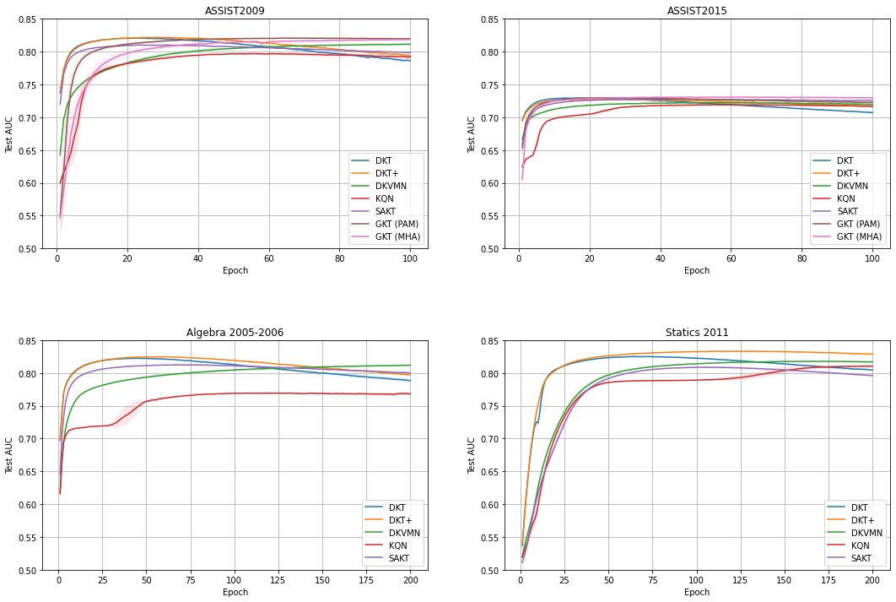

# Knowledge Tracing Collection with PyTorch

This repository is a collection of the following knowledge tracing algorithms:
- **Deep Knowledge Tracing (DKT)**
- **Deep Knowledge Tracing + (DKT+)**
- **Dynamic Key-Value Memory Networks for Knowledge Tracing (DKVMN)**
- **Knowledge Query Network for Knowledge Tracing (KQN)**
- **A Self-Attentive model for Knowledge Tracing (SAKT)**
- **Graph-based Knowledge Tracing (GKT)**

More algorithms will be added on this repository soon.

In this repository, [ASSISTment2009](https://sites.google.com/site/assistmentsdata/home/assistment-2009-2010-data) "skill-builder" dataset are used. You need to download the dataset on the following path:

```
datasets/ASSIST2009/
```

Also, you can use the [ASSISTment2015](https://sites.google.com/site/assistmentsdata/home/2015-assistments-skill-builder-data) "skill-builder" dataset. Similarly you need to download them on the following path:

```
datasets/ASSIST2015/
```

Other datasets, [Algebra 2005-2006](https://pslcdatashop.web.cmu.edu/KDDCup/downloads.jsp) and [Statics 2011](https://pslcdatashop.web.cmu.edu/DatasetInfo?datasetId=507) dataset can be used to train your knowledge tracing model. The pathes to download each dataset are as follows:

```
datasets/Algebra2005
```

```
datasets/Statics2011
```

## Install Dependencies
1. Install Python 3.
2. Install the Python packages in `requirements.txt`. If you are using a virtual environment for Python package management, you can install all python packages needed by using the following bash command:

    ```bash
    $ pip install -r requirements.txt
    ```

3. Install PyTorch. The version of PyTorch should be greater or equal than 1.7.0. This repository provides the CUDA usage.

    *Note*: There are some bugs in the `pytorch.utils.data` module on the PyTorch version 1.9.0. If you want to run this repository safely, you need to install the PyTorch version 1.7.0 or 1.8.0. You can check the bugs closely in the following links:
    - [https://github.com/pytorch/pytorch/issues/44714](https://github.com/pytorch/pytorch/issues/44714)
    - [https://github.com/dunbar12138/DSNeRF/issues/3](https://github.com/dunbar12138/DSNeRF/issues/3)

## Training and Running
1. Modify `config.json` as your machine setting. The following explanations are for understanding `train_config` of `config.json`:
    - `batch_size`: The batch size of the training process. Default: 256
    - `num_epochs`: The number of epochs of the training process. Default: 100
    - `train_ratio`: The ratio of the training dataset to split the whole dataset. Default: 0.9
    - `learning_rate`: The learning of the optimizer for the training process. Default: 0.001
    - `optimizer`: The optimizer to use in the training process. The possible optimizers are ["sgd", "adam"]. Default: "adam"
    - `seq_len`: The sequence length for the dataset to use in the training process. Default: 100
2. Execute training process by `train.py`. An example of usage for `train.py` are following:

    ```bash
    $ python train.py --model_name=dkvmn
    ```

    The following bash command will help you:

    ```bash
    $ python train.py -h
    ```

## Training Results

  

### Training Configurations
|Dataset|Configurations|
|---|---|
|ASSISTment2009|`batch_size`: 256, `num_epochs`: 100, `train_ratio`: 0.9, `learning_rate`: 0.001, `optimizer`: "adam", `seq_len`: 100|
|ASSISTment2015|`batch_size`: 256, `num_epochs`: 100, `train_ratio`: 0.9, `learning_rate`: 0.001, `optimizer`: "adam", `seq_len`: 50|
|Algebra 2005-2006|`batch_size`: 256, `num_epochs`: 200, `train_ratio`: 0.9, `learning_rate`: 0.001, `optimizer`: "adam", `seq_len`: 200|
|Statics 2011|`batch_size`: 256, `num_epochs`: 200, `train_ratio`: 0.9, `learning_rate`: 0.001, `optimizer`: "adam", `seq_len`: 200|

### ASSISTment2009 Result
|Model|Maximum Test AUC (%)|Hyperparameters|
|---|---|---|
|DKT|82.15 &pm; 0.05|`emb_size`: 100, `hidden_size`: 100|
|DKT+|82.25 &pm; 0.06|`emb_size`: 100, `hidden_size`: 100, `lambda_r`: 0.01, `lambda_w1`: 0.03, `lambda_w2`: 0.3|
|DKVMN|81.18 &pm; 0.16|`dim_s`: 50, `size_m`: 20|
|KQN|79.82 &pm; 0.11|`dim_v`: 100, `dim_s`: 100, `hidden_size`: 100|
|SAKT|81.06 &pm; 0.08|`n`: 100, `d`: 100, `num_attn_heads`: 5, `dropout` 0.2|
|GKT (PAM)|82.12 &pm; 0.08|`hidden_size`: 30|
|GKT (MHA)|81.88 &pm; 0.17|`hidden_size`: 30|

### ASSISTment2015 Result
|Model|Maximum Test AUC (%)|Hyperparameters|
|---|---|---|
|DKT|72.99 &pm; 0.04|`emb_size`: 50, `hidden_size`: 50|
|DKT+|72.78 &pm; 0.06|`emb_size`: 50, `hidden_size`: 50, `lambda_r`: 0.01, `lambda_w1`: 0.03, `lambda_w2`: 0.3|
|DKVMN|72.29 &pm; 0.05|`dim_s`: 50, `size_m`: 10|
|KQN|71.97 &pm; 0.14|`dim_v`: 50, `dim_s`: 50, `hidden_size`: 50|
|SAKT|72.80 &pm; 0.05|`n`: 50, `d`: 50, `num_attn_heads`: 5, `dropout` 0.3|
|GKT (PAM)|73.02 &pm; 0.13|`hidden_size`: 30|
|GKT (MHA)|73.14 &pm; 0.07|`hidden_size`: 30|

### Algebra 2005-2006 Result
|Model|Maximum Test AUC (%)|Hyperparameters|
|---|---|---|
|DKT|82.29 &pm; 0.06|`emb_size`: 100, `hidden_size`: 100|
|DKT+|82.53 &pm; 0.06|`emb_size`: 100, `hidden_size`: 100, `lambda_r`: 0.01, `lambda_w1`: 0.03, `lambda_w2`: 1.0|
|DKVMN|81.20 &pm; 0.14|`dim_s`: 50, `size_m`: 20|
|KQN|77.08 &pm; 0.14|`dim_v`: 100, `dim_s`: 100, `hidden_size`: 100|
|SAKT|81.28 &pm; 0.07|`n`: 200, `d`: 100, `num_attn_heads`: 5, `dropout` 0.2|

### Statics 2011 Result
|Model|Maximum Test AUC (%)|Hyperparameters|
|---|---|---|
|DKT|82.56 &pm; 0.09|`emb_size`: 50, `hidden_size`: 50|
|DKT+|83.36 &pm; 0.08|`emb_size`: 50, `hidden_size`: 50, `lambda_r`: 0.01, `lambda_w1`: 0.03, `lambda_w2`: 3.0|
|DKVMN|81.80 &pm; 0.08|`dim_s`: 50, `size_m`: 10|
|KQN|81.10 &pm; 0.13|`dim_v`: 50, `dim_s`: 50, `hidden_size`: 50|
|SAKT|80.90 &pm; 0.13|`n`: 200, `d`: 50, `num_attn_heads`: 5, `dropout` 0.3|

The fact that `Adam Optimizer` has better performance on the training of DKT and DKVMN can be checked easily by running this repository.

SAKT looks like suffering an over-fitting. It seems that other tools to decrease the over-fitting will help the performance of SAKT. In fact, the results show that the dropout methods can relieve the over-fitting of the performance of SAKT.

## Recent Works
- Fixed some **critical** errors in DKT.
- Modified the initialization of some parameters in DKVMN and SAKT.
- Refactored `models.utils.py`.
- Implemented DKT+.
- Implemented PAM and MHA of GKT.
- Implemented KQN.
- Updated the performance results of KQN.

## Future Works
- Implement SKVMN.

## References
- [Attention Is All You Need](https://arxiv.org/pdf/1706.03762.pdf)
- DKT: [Deep Knowledge Tracing](https://papers.nips.cc/paper/5654-deep-knowledge-tracing.pdf)
- DKT+: [Addressing Two Problems in Deep Knowledge Tracing via Prediction-Consistent Regularization](https://arxiv.org/pdf/1806.02180.pdf)
- DKVMN: [Dynamic Key-Value Memory Networks for Knowledge Tracing](https://arxiv.org/pdf/1611.08108.pdf)
- SKVMN: [Knowledge Tracing with Sequential Key-Value Memory Networks](https://arxiv.org/pdf/1910.13197.pdf)
- SAKT: [A Self-Attentive model for Knowledge Tracing](https://arxiv.org/pdf/1907.06837.pdf)
- For the implementation of SAKT: [PyTorch Transforme Encoder Layer](https://pytorch.org/docs/stable/_modules/torch/nn/modules/transformer.html#TransformerEncoderLayer)
- GKT: [Graph-based Knowledge Tracing: Modeling Student Proficiency Using Graph Neural Network](https://rlgm.github.io/papers/70.pdf)
- KQN: [Knowledge Query Network for Knowledge Tracing](https://arxiv.org/pdf/1908.02146.pdf)
- AKT: [Context-Aware Attentive Knowledge Tracing](https://arxiv.org/pdf/2007.12324.pdf)
- CKT: [Convolutional Knowledge Tracing: Modeling Individualization in Student Learning Process](https://www.researchgate.net/profile/Shen-Shuanghong/publication/343214175_Convolutional_Knowledge_Tracing_Modeling_Individualization_in_Student_Learning_Process/links/600fd43a45851553a06fe85d/Convolutional-Knowledge-Tracing-Modeling-Individualization-in-Student-Learning-Process.pdf)
